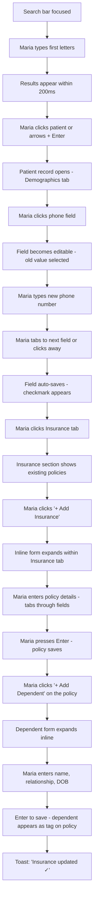
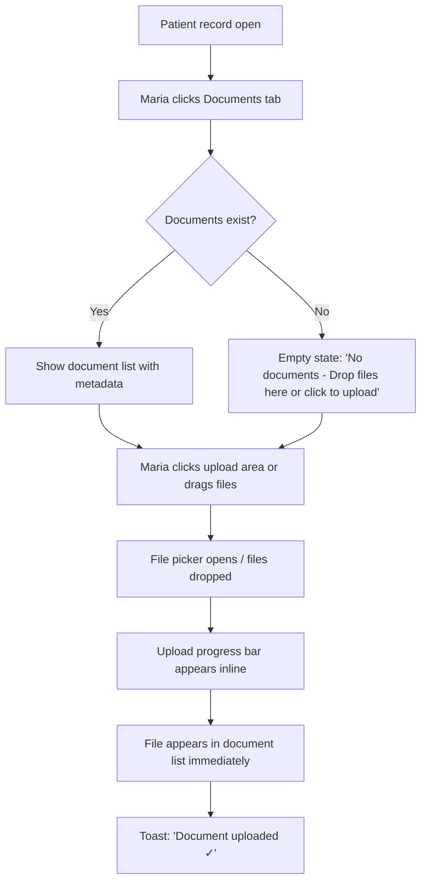
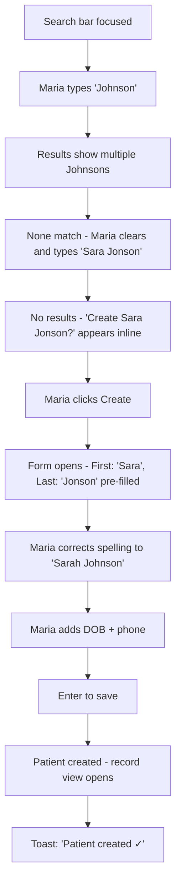

---
stepsCompleted:
  - step-01-init
  - step-02-discovery
  - step-03-core-experience
  - step-04-emotional-response
  - step-05-inspiration
  - step-06-design-system
  - step-07-defining-experience
  - step-08-visual-foundation
  - step-09-design-directions
  - step-10-user-journeys
  - step-11-component-strategy
  - step-12-ux-patterns
  - step-13-responsive-accessibility
  - step-14-complete
inputDocuments:
  - _bmad-output/planning-artifacts/prd.md
  - _bmad-output/planning-artifacts/prd-validation-report.md
---

# UX Design Specification - patientVault

**Author:** Neil
**Date:** 2026-03-25

---

## Executive Summary

### Project Vision

patientVault is a demo-quality patient CRM for clinic front desk staff, built as a responsive SPA. The product proves that patient management software can be fast, clean, and intuitive — and that building one doesn't have to be hard. The demo audience is developers evaluating platform capability. Speed and simplicity are the core differentiators at every layer.

### Target Users

**Maria — Front Desk Coordinator:** Juggles phone calls, walk-in patients, and returning patients simultaneously. Time-pressured, not deeply technical, needs to context-switch rapidly between patients. Her workflow is: search for patient → view/update record → move to next patient. Every second of friction compounds across a busy morning.

### Key Design Challenges

1. **Search as the hub** — search is the entry point for every workflow. The search bar is the app's front door — getting this interaction pattern wrong breaks every journey.
2. **Information density vs. simplicity** — patient records span demographics, contacts, documents, insurance, and dependents. On mobile especially, this must stay navigable without feeling cluttered.
3. **Mobile-first that doesn't feel compromised** — the phone demo must feel intentional, not a squeezed-down desktop layout.

### Design Opportunities

1. **Search-to-create as a "wow" moment** — the empty state → create flow is inherently delightful when done right. This is where the demo wins the audience.
2. **Optimistic feedback patterns** — every save, edit, and upload can feel instant with the right visual feedback. This is where "snappy" becomes tangible to the viewer.
3. **Progressive disclosure on patient records** — start with what matters (name, contact), reveal depth (insurance, documents) as needed. Keeps the interface clean while supporting complex workflows.

## Core User Experience

### Defining Experience

The core loop is **search → act → move on**. Every workflow starts and ends at the search bar. Maria types, finds (or creates), updates, and is back to the search bar ready for the next patient. The search bar is not a feature — it's the application's primary interface.

### Platform Strategy

- **Input mode:** Keyboard-first on desktop, touch-adapted on mobile
- **Desktop demo context:** Board meeting presentation — the presenter navigates entirely by keyboard (type to search, tab through fields, enter to save)
- **Mobile:** Touch-optimized with large tap targets, but same flow structure
- **Responsive breakpoints:** Mobile (< 768px), Desktop (>= 768px)
- **No offline requirement** — connected demo environment

### Effortless Interactions

- **Search:** Type anywhere, results appear instantly — no click-to-focus, no search button
- **Create from nothing:** Empty database shows a welcoming "Add Your First Patient" prompt; empty search shows "Create New Patient?" with pre-filled data
- **Field editing:** Click/tap a field, type, tab to next — auto-saves on blur. No edit/save toggle.
- **Section navigation:** Tab/section headers within patient record — keyboard arrow keys or click
- **Form completion:** Tab through required fields, enter to save. Minimal required fields so the happy path is fast.

### Critical Success Moments

1. **First launch (empty state):** Maria sees "Add Your First Patient" — clear, inviting, zero confusion. One click to start.
2. **Search-to-create handoff:** Maria searches, gets no result, and flows seamlessly into creation with her search terms pre-filled. The audience notices the smooth transition.
3. **Inline save feedback:** Maria edits a phone number, tabs away, and a subtle confirmation appears instantly. No save button, no spinner, no modal.
4. **Full record navigation:** Maria moves between demographics, documents, and insurance without any page reload or context loss. It just flows.

### Experience Principles

1. **Search is home** — the search bar is the starting point, the navigation, and the fallback. When in doubt, the user returns to search.
2. **Zero-click feedback** — every action confirms itself without requiring the user to do anything extra. Saves happen, confirmations appear, states update.
3. **Keyboard velocity** — the fastest path through any workflow is keyboard-only. Mouse/touch works, but keyboard is fastest.
4. **Progressive reveal** — show what matters now, reveal depth on demand. Patient name and contact first, insurance and documents when needed.
5. **No dead ends** — every screen has a clear next action. Empty states are invitations, not errors.

## Desired Emotional Response

### Primary Emotional Goals

- **Maria feels:** In control, fast, effortless — the tool keeps up with her pace, never the bottleneck
- **Board feels:** Impressed by simplicity — "why doesn't our tool do this?" followed by "that was easy to build?"
- **Demo presenter feels:** Confident — every click lands, every flow is smooth, nothing to apologize for

### Emotional Journey Mapping

| Moment | Maria's Emotion | Board's Emotion |
|---|---|---|
| First launch (empty state) | Welcomed, clear on what to do | "Clean, no clutter" |
| First patient creation | Fast, accomplished | "That was quick" |
| Search and find | Confident, in control | "Instant results" |
| Inline edit + auto-save | Effortless, trusting | "No save button needed?" |
| Search-to-create handoff | Seamless, no friction | "Wait, it just did that?" |
| Document upload | Done, no ceremony | "Simple" |
| Insurance + dependents | Capable, organized | "Handles complexity cleanly" |

### Micro-Emotions

- **Confidence over confusion** — every screen is self-explanatory, Maria never wonders "what do I do now?"
- **Trust over skepticism** — auto-save feedback confirms actions happened, no doubt about state
- **Accomplishment over frustration** — tasks complete quickly, visible progress, no dead ends
- **Calm over anxiety** — errors are forgiving and helpful, not alarming

### Design Implications

- **Confidence** → Clear visual hierarchy, obvious primary actions, consistent patterns across all sections
- **Speed/Control** → Keyboard shortcuts, instant feedback, no confirmation dialogs for routine actions
- **Trust** → Subtle save confirmations (checkmarks, toast messages), consistent auto-save behavior everywhere
- **Forgiveness** → Empty search results guide to creation, undo capability for edits, no destructive actions without confirmation

### Emotional Design Principles

1. **Never make Maria wait** — if the UI hesitates, trust breaks. Every interaction responds within 100ms.
2. **Confirm without interrupting** — save confirmations appear and fade, never blocking the next action.
3. **Guide, don't scold** — empty states and errors are helpful prompts, not error messages.
4. **Consistency builds trust** — the same interaction pattern works the same way everywhere. Edit a phone number or edit an insurance field — same gesture, same feedback.

## UX Pattern Analysis & Inspiration

### Inspiring Products Analysis

**macOS Spotlight / Alfred — Search as interface**
The search bar IS the application. Type to find, act on results directly, keyboard-driven. No navigation menus, no hierarchy to learn. The user types intent and gets results. This is the model for patientVault's search bar.

**Linear — Keyboard-first productivity**
Every action has a keyboard shortcut. Navigation feels instant because there's no page reload, just smooth transitions between views. Lists, detail views, and editing all happen in a fluid single-page experience. The UI stays out of the way.

**Notion — Inline editing**
Click any text to edit it. No edit mode toggle, no save button. Changes persist immediately with subtle visual confirmation. This is the model for patient record field editing.

**Apple Contacts — Simple record management**
Clean card-based layout for contact information. Sections are visible but not overwhelming. Adding a phone number or address follows a consistent, minimal pattern. Proves that record management can feel lightweight.

### Transferable UX Patterns

**Navigation Patterns:**
- **Command palette search** (Spotlight/Alfred) → global search bar as the primary navigation method
- **Sidebar-to-detail** (Apple Contacts) → patient list on left, record detail on right (desktop); list-then-detail (mobile)

**Interaction Patterns:**
- **Click-to-edit fields** (Notion) → tap any field to edit, blur to save, no edit/save toggle
- **Keyboard-first navigation** (Linear) → tab between fields, enter to confirm, escape to cancel
- **Inline creation** (Linear) → create new items without navigating away from context

**Feedback Patterns:**
- **Subtle toast confirmations** (Linear) → brief, non-blocking save confirmations that fade automatically
- **Optimistic UI** (Notion) → UI updates before server confirms, feels instant
- **Empty state as onboarding** (Notion) → blank canvas with clear invitation to create first item

### Anti-Patterns to Avoid

- **Modal dialogs for routine actions** — never interrupt flow with "Are you sure?" for saves or navigation. Reserve modals for destructive actions only (archive).
- **Explicit edit/save modes** — toggling between "view mode" and "edit mode" adds friction. Every field is always editable.
- **Heavy form wizards** — multi-step forms with progress bars feel slow. Patient creation should be one clean form, not a wizard.
- **Sidebar navigation menus** — hamburger menus and nav drawers hide functionality. Search replaces navigation.
- **Loading spinners** — if the user sees a spinner during the demo, we've already lost. Optimistic updates and instant transitions instead.

### Design Inspiration Strategy

**Adopt:**
- Spotlight-style search as the entry point for everything
- Notion-style click-to-edit with auto-save on blur
- Linear-style keyboard shortcuts and instant transitions
- Toast-style non-blocking confirmations

**Adapt:**
- Apple Contacts card layout → adapt for patient records with tabbed sections (demographics, documents, insurance)
- Sidebar-detail pattern → make responsive (side-by-side on desktop, stacked on mobile)

**Avoid:**
- Modal confirmations for routine actions
- Edit/save mode toggles
- Multi-step form wizards
- Loading spinners anywhere in the demo flow

## Design System Foundation

### Design System Choice

**shadcn/ui** — a component collection built on Radix UI primitives with Tailwind CSS styling. Components are copied directly into the project (not an npm dependency), giving full control over customization while starting from a polished baseline.

### Rationale for Selection

- **Speed:** Pre-built components for forms, tables, dialogs, tabs, toasts, search inputs — all needed for patientVault
- **Polish:** Looks professional out of the box with minimal customization — critical for a board meeting demo
- **Keyboard accessibility:** Built on Radix primitives, which handle focus management, keyboard navigation, and ARIA attributes automatically
- **Tailwind integration:** Utility-first styling makes responsive design fast and consistent
- **Full ownership:** Components live in the project, no external dependency lock-in. Easy to customize without fighting a framework
- **Solo dev friendly:** One person can ship a polished UI fast with this stack

### Implementation Approach

- Install shadcn/ui CLI and initialize with Tailwind config
- Pull components as needed: Input, Button, Table, Tabs, Dialog, Toast, Command (for search), Card
- Use the Command component (cmdk-based) for the Spotlight-style search bar
- Use Tabs for patient record section navigation
- Use Toast for non-blocking save confirmations
- Use Card layout for patient record display

### Customization Strategy

- **Color palette:** Clean, professional — neutral grays with a single accent color for primary actions and feedback
- **Typography:** System font stack for speed, clear hierarchy (patient name prominent, metadata subdued)
- **Spacing:** Generous whitespace to reinforce the "clean, no clutter" principle
- **Dark/Light:** Light mode only for MVP — keeps scope tight and looks clean in a board meeting setting
- **Mobile adaptations:** Tailwind responsive utilities handle breakpoints; component layouts stack naturally

## Defining Experience

### The Core Interaction

**"Type to find anyone, click to update anything."**

The search bar and click-to-edit are the two interactions that define patientVault. If these feel instant and effortless, the entire product succeeds. Everything else — documents, insurance, dependents — hangs off these two primitives.

### User Mental Model

**The Smart Rolodex.** Maria's mental model is a card file: flip to a name, read the card, write on it, flip to the next. patientVault digitizes this model without adding complexity.

- **Paper world:** Grab folder → open → read/write → close → grab next
- **Typical CRM:** Navigate menu → search → click result → click edit → fill form → click save → navigate back
- **patientVault:** Type name → click result → click field → type → done

Each step in the patientVault flow removes ceremony that the typical CRM adds. No menu navigation, no edit mode, no save button, no navigation back. The card is always there, always editable.

### Success Criteria

- User finds an existing patient in under 3 seconds from any screen
- New patient creation completes in under 15 seconds (name, DOB, phone)
- Field edits save without any explicit save action — user tabs away and it's done
- Zero navigational steps between search and patient record detail
- Demo presenter can complete the full Journey 1 (new patient) without touching the mouse

### Pattern Analysis

**Established patterns, executed exceptionally:**
- **Search-as-navigation** — proven by Spotlight, Alfred, VS Code command palette. Users already know this pattern.
- **Click-to-edit** — proven by Notion, Airtable, spreadsheets. No learning curve.
- **Tabbed sections** — proven by every contact/CRM app. Familiar information architecture.
- **Toast notifications** — proven by every modern SPA. Non-blocking feedback.

**No novel patterns required.** The innovation is in the *removal of friction*, not the addition of new interactions. Every pattern is familiar — patientVault just chains them together without the usual gaps.

### Experience Mechanics

**1. Initiation — Search**
- App loads → search bar is focused automatically (keyboard ready)
- Empty state: "Add Your First Patient" button centered below search
- With patients: type to search, results appear within 200ms
- No results: "No patients found — Create New Patient?" with search terms carried over

**2. Interaction — Patient Record**
- Click search result → patient record opens instantly (card layout)
- Record shows: name (prominent), DOB, phone at top; tabbed sections below (Demographics, Documents, Insurance)
- Click any field → field becomes editable inline
- Tab to next field → previous field auto-saves
- Toast appears briefly: "Saved" with checkmark, fades after 2 seconds

**3. Feedback — Confirmation**
- Field save: subtle green checkmark next to field, fades
- Toast: "Patient updated" appears bottom-right, auto-dismisses
- Error: field highlights red with inline message, no modal
- Document upload: progress bar inline, file appears in list immediately on completion

**4. Completion — Return to Search**
- No explicit "done" action needed — record is always saved
- Click search bar or press `/` to return to search from anywhere
- Back to search → ready for next patient
- The loop restarts naturally

## Visual Design Foundation

### Color System

**Base Palette (shadcn/ui defaults, refined):**
- **Background:** White (`#FFFFFF`) — clean canvas
- **Surface:** Slate 50 (`#F8FAFC`) — subtle card backgrounds, section differentiation
- **Border:** Slate 200 (`#E2E8F0`) — light, unobtrusive separators
- **Text Primary:** Slate 900 (`#0F172A`) — high contrast, easy to read
- **Text Secondary:** Slate 500 (`#64748B`) — metadata, labels, timestamps
- **Text Muted:** Slate 400 (`#94A3B8`) — placeholders, hints

**Accent Color:**
- **Primary:** Blue 600 (`#2563EB`) — primary actions, active states, links
- **Primary Hover:** Blue 700 (`#1D4ED8`) — hover states
- **Primary Light:** Blue 50 (`#EFF6FF`) — selected states, active tab backgrounds

**Semantic Colors:**
- **Success:** Emerald 500 (`#10B981`) — save confirmations, checkmarks
- **Error:** Red 500 (`#EF4444`) — validation errors, required field highlights
- **Warning:** Amber 500 (`#F59E0B`) — cautionary states (archive confirmation)

**Feedback Colors:**
- Save confirmation toast: Emerald 500 background, white text
- Error inline: Red 500 text below field, red border on field
- Active/focused field: Blue 600 border ring

### Typography System

**Font Stack:** System fonts — `-apple-system, BlinkMacSystemFont, "Segoe UI", Roboto, sans-serif`
- No custom font loading — instant render, zero FOIT/FOUT
- System fonts feel native on every platform

**Type Scale:**
- **Patient Name (h1):** 24px / 32px line-height, semibold — the most prominent element on any screen
- **Section Headers (h2):** 18px / 28px, semibold — tab labels, section titles
- **Field Labels:** 14px / 20px, medium, Slate 500 — above or beside editable fields
- **Field Values:** 16px / 24px, regular, Slate 900 — the content Maria reads and edits
- **Metadata:** 12px / 16px, regular, Slate 400 — timestamps, file sizes, secondary info
- **Button Text:** 14px / 20px, medium — consistent across all buttons

### Spacing & Layout Foundation

**Base Unit:** 4px — all spacing is multiples of 4
- **Tight:** 4px (within grouped elements)
- **Default:** 8px (between related elements)
- **Comfortable:** 16px (between sections within a card)
- **Spacious:** 24px (between major sections)
- **Page Margin:** 32px desktop, 16px mobile

**Layout Structure:**
- **Desktop:** Centered max-width container (1024px) with generous side margins. Search bar at top, patient record below as a card.
- **Mobile:** Full-width with 16px padding. Same vertical flow, stacked layout.
- **No sidebar navigation** — search replaces nav. The layout is a single column focused on the current context.

**Component Spacing:**
- Card padding: 24px
- Form field gap: 16px vertical
- Tab content padding: 16px
- Toast position: bottom-right, 16px from edges

### Accessibility Considerations

- All text meets WCAG AA contrast ratios against background (Slate 900 on White = 15.4:1)
- Focus rings visible on all interactive elements (Blue 600, 2px ring)
- Touch targets minimum 44px on mobile
- System fonts ensure readability at all sizes without custom font rendering issues
- Color is never the sole indicator of state — icons/text accompany color changes (checkmark + green for success, icon + red for error)

## Design Direction Decision

### Design Directions Explored

Three directions were explored via interactive HTML mockups (`ux-design-directions.html`):

- **Direction A: Search-Centered** — hero search, single-column, patient record as full-width card below search
- **Direction B: Split Panel** — persistent left panel (search + list), detail on right. Traditional CRM layout.
- **Direction C: Compact Dense** — same as A with tighter spacing, more data visible, less whitespace

Mobile views were explored showing Direction A's responsive adaptation: stacked layout, touch-optimized, back-arrow navigation.

### Chosen Direction

**Direction A: Search-Centered** — single-column, search-first layout.

### Design Rationale

- **Simplest layout** — one focus area at a time, no split attention
- **Demos best** — presenter walks through a clear visual narrative (search → results → record)
- **Mobile-native** — single column translates to mobile without layout restructuring
- **Matches principles** — "search is home", progressive reveal, no clutter
- **Fastest to build** — no complex split-panel responsive logic, single column with cards

### Implementation Approach

- **Home/Empty state:** Hero search bar centered, "Add Your First Patient" CTA below
- **Search active:** Search bar at top (sticky), results dropdown below
- **Patient record:** Full-width card below search bar with patient header, tabbed sections
- **Mobile:** Same flow, stacked. Back arrow returns to search. Tabs scroll horizontally if needed.
- **Transitions:** No page reloads — SPA transitions between search results and patient record views

## User Journey Flows

### Journey 1: New Patient Creation

**Entry:** Maria types a name into the search bar. No results match.

```mermaid
flowchart TD
    A[App loads - Search bar focused] --> B[Maria types patient name]
    B --> C{Results found?}
    C -->|Yes| D[Show matching patients in dropdown]
    C -->|No| E[Show 'No results - Create "Name"?' inline]
    E --> F[Maria clicks Create or presses Enter]
    F --> G[Creation form opens - search terms pre-fill name fields]
    G --> H[Maria enters DOB + phone - tabs between fields]
    H --> I[Maria presses Enter or clicks Save]
    I --> J[Patient created - record view opens immediately]
    J --> K[Toast: 'Patient created ✓' - fades after 2s]
    D --> L[Maria clicks a result]
    L --> J
```

**Screen states:**
1. **Search active, no results:** Dropdown shows single row: "No patients found — Create `Sarah Johnson`?" with search terms bolded
2. **Creation form:** Single card, minimal fields — First Name, Last Name (pre-filled from search), DOB, Phone. All other fields optional. Focus lands on first empty field.
3. **Record view:** Immediately shows the new patient record with all tabs available. Demographics tab active by default.

**Keyboard flow:** Type → Enter (create) → Tab (DOB) → Tab (Phone) → Enter (save) → Record view. Five keystrokes from search to saved patient.

---

### Journey 2: Returning Patient Updates

**Entry:** Maria types a few letters, selects a patient, updates fields.



**Screen states:**
1. **Demographics tab:** Two-column grid of click-to-edit fields. Hover shows subtle border. Click activates input with existing value selected.
2. **Insurance tab:** List of insurance cards. Each card shows provider, policy number, group, member ID, and dependent tags. "+ Add Insurance" button at bottom.
3. **Add insurance form:** Expands inline within the tab — no modal, no navigation. Fields: Provider, Policy Number, Group Number, Member ID. Enter to save.
4. **Add dependent:** Expands within the insurance card. Fields: Name, Relationship (dropdown), DOB. Enter to save, appears as a tag.

---

### Journey 3: Document Upload

**Entry:** Maria opens a patient record and navigates to Documents tab.



**Screen states:**
1. **Documents tab, empty:** Dashed border drop zone with upload icon. "Drop files here or click to browse." Accepts PDF, JPG, PNG.
2. **Documents tab, with files:** Simple list — filename, file type icon, upload date, file size. Most recent first. Drop zone persists at top for additional uploads.
3. **Upload in progress:** Progress bar appears inline above the document list. File appears in list immediately on completion with metadata auto-populated.

---

### Journey 4: Search-to-Create Recovery

**Entry:** Maria searches for a patient who doesn't exist, tries variations, then creates.



**Key UX detail:** The pre-filled fields from search are fully editable. Maria can correct the spelling before saving. The search-to-create flow doesn't lock in the search terms — they're suggestions, not constraints.

---

### Journey Patterns

**Consistent patterns across all journeys:**

| Pattern | Behavior | Used In |
|---|---|---|
| Search entry | Type to search, results within 200ms, keyboard navigable | All journeys |
| Click-to-edit | Click field → editable → tab/blur to auto-save | Journey 2, 3 |
| Inline expansion | New forms expand within current context, no modal/navigation | Journey 2 (insurance, dependents) |
| Toast confirmation | Bottom-right, auto-dismiss after 2s, non-blocking | All journeys |
| Empty state as CTA | Empty states invite action, never feel like errors | Journey 1, 3, 4 |
| Keyboard completion | Tab between fields, Enter to save/submit | All journeys |
| Data carry-over | Search terms pre-populate creation forms | Journey 1, 4 |

### Flow Optimization Principles

1. **Minimize keystrokes to value** — every journey is optimized for the fewest possible interactions from intent to completion
2. **No mode switching** — no separate "view" and "edit" modes. The record is always live.
3. **Inline everything** — forms expand in place. Nothing navigates away from the patient record context.
4. **Forgiving inputs** — pre-filled data is editable, search is fuzzy, empty states guide rather than block
5. **Consistent confirmation** — every successful action gets the same toast pattern. Users learn the feedback language once.

## Component Strategy

### Design System Components (shadcn/ui — use as-is)

| Component | shadcn Name | Used For |
|---|---|---|
| Search bar | `Command` (cmdk) | Global patient search, keyboard navigation |
| Tabs | `Tabs` | Patient record sections (Demographics, Documents, Insurance) |
| Input fields | `Input` | All form fields — patient creation, inline editing |
| Buttons | `Button` | Save, Add, Upload actions |
| Toast notifications | `Toast` / `Sonner` | Save confirmations, upload success |
| Dropdown select | `Select` | Gender, relationship type (dependent) |
| Dialog | `Dialog` | Archive confirmation (only destructive action) |
| Card | `Card` | Patient record container, insurance policy cards |
| Badge | `Badge` | Dependent tags on insurance cards |
| Label | `Label` | Form field labels |
| Separator | `Separator` | Section dividers |

### Custom Components (build on shadcn primitives)

**1. PatientSearchResult**
- **Purpose:** Single row in search results dropdown
- **Content:** Patient name (bold), DOB, phone number
- **States:** Default, hover (blue-50 bg), selected/active (keyboard navigation), empty-state-create-prompt
- **Keyboard:** Arrow keys navigate, Enter selects
- **Accessibility:** `role="option"` within `role="listbox"`, `aria-selected`

**2. EditableField**
- **Purpose:** Click-to-edit field that auto-saves on blur
- **Content:** Label above, value displayed as text. Click transforms to input.
- **States:** Display (text), hover (subtle border appears), editing (input with focus ring), saving (brief spinner), saved (green checkmark fades in/out)
- **Keyboard:** Tab to focus, Enter or Tab to save and move to next field, Escape to cancel edit
- **Accessibility:** `aria-label` matches field label, announces "editing" and "saved" states

**3. InlineForm**
- **Purpose:** Expandable form that appears within current context (no modal/navigation)
- **Content:** Configurable field set. Used for: Add Insurance, Add Dependent, Create Patient.
- **States:** Collapsed (show "+ Add" button), expanded (form fields visible), submitting, submitted (collapses, new item appears in list)
- **Keyboard:** Enter on "+ Add" expands form, Tab through fields, Enter to submit
- **Accessibility:** `aria-expanded` on trigger, focus moves to first field on expand

**4. DocumentDropZone**
- **Purpose:** File upload area with drag-and-drop support
- **Content:** Upload icon, instruction text, accepted file types
- **States:** Default (dashed border), drag-hover (blue border, blue-50 bg), uploading (progress bar), complete (file appears in list)
- **Keyboard:** Enter/Space to trigger file picker
- **Accessibility:** `role="button"`, `aria-label="Upload documents"`

**5. InsuranceCard**
- **Purpose:** Display insurance policy with dependent tags and inline edit capability
- **Content:** Provider name, policy number, group number, member ID, dependent tags
- **States:** Default (read-only card), hover (subtle shadow), editing (fields become inputs), with-dependents (tags below details)
- **Actions:** Edit fields inline, add dependent, remove dependent, remove policy

**6. EmptyState**
- **Purpose:** Welcoming prompt when no data exists
- **Content:** Icon, heading, description, primary CTA button
- **Variants:** First-time (hero size, centered), section-empty (smaller, within tab content)
- **Used for:** No patients (first launch), no documents, no insurance

### Component Implementation Strategy

- **Build order matches journey priority:** PatientSearchResult and EditableField first (critical for Journey 1 & 2), then InlineForm and InsuranceCard (Journey 2), then DocumentDropZone (Journey 3), then EmptyState (polishing)
- **All custom components built with shadcn primitives** — use `cn()` utility for class merging, Tailwind for styling, Radix primitives for accessibility
- **Single interaction pattern per component** — each component does one thing well

### Implementation Roadmap

**Phase 1 — Core (Day 1-2):**
- PatientSearchResult + Command integration (search flow)
- EditableField (inline editing pattern)
- EmptyState (first-launch experience)

**Phase 2 — Records (Day 3):**
- InlineForm (add insurance, add dependent, create patient)
- InsuranceCard (insurance display + dependent tags)

**Phase 3 — Documents (Day 4):**
- DocumentDropZone (upload + progress)

**Phase 4 — Polish (Day 5):**
- Toast integration across all flows
- Keyboard shortcut refinement
- Mobile responsive tuning

## UX Consistency Patterns

### Button Hierarchy

| Level | Style | Usage | Examples |
|---|---|---|---|
| Primary | Blue 600 bg, white text, rounded-8 | One per context — the main action | "Save", "Create Patient", "Upload" |
| Secondary | White bg, slate border, slate text | Supporting actions | "Cancel", "Add Another" |
| Ghost | No border, blue text | Inline actions, low-emphasis | "+ Add Dependent", "+ Add Insurance" |
| Destructive | Red 500 bg, white text | Irreversible actions (behind dialog) | "Archive Patient" |

**Rules:**
- Maximum one primary button visible per screen area
- Ghost buttons for inline add/create actions within cards
- Destructive actions always require Dialog confirmation
- All buttons have visible focus ring (Blue 600, 2px) for keyboard navigation

### Feedback Patterns

| Type | Visual | Duration | Used For |
|---|---|---|---|
| Save success | Toast bottom-right: green bg, checkmark icon, "Saved" | Auto-dismiss 2s | Field auto-save, form submit |
| Create success | Toast: green bg, checkmark, "Patient created" | Auto-dismiss 2s | New patient, new insurance, new dependent |
| Upload success | Toast: green bg, checkmark, "Document uploaded" | Auto-dismiss 2s | File upload complete |
| Field error | Red border on field + red text below field | Persistent until fixed | Validation failure |
| Submit error | Red border on all invalid fields + toast: "Please fix highlighted fields" | Toast 3s, borders persist | Missing required fields on submit |

**Rules:**
- Toasts never block interaction — they appear and fade, user never has to dismiss
- Toasts stack if multiple appear (max 3 visible)
- Field errors clear automatically when the user corrects the value
- No error modals ever — all errors are inline or toast

### Form Patterns

**Field Layout:**
- Two-column grid on desktop (>= 768px), single column on mobile
- Labels above fields, uppercase 12px Slate 500
- Required fields indicated by red asterisk on label (only during creation forms)
- Optional fields have no indicator — they're just there if needed

**Validation:**
- **On blur:** Individual required field validation. If empty and required, show red border + "Required" text below.
- **On submit (Enter):** Final validation pass. Highlights all invalid fields simultaneously. Focus moves to first invalid field. Toast: "Please fix highlighted fields."
- **On correction:** Error clears immediately when user types a valid value and blurs. No submit needed to clear errors.

**Field Behavior:**
- Click field → value selected (all text) → type to replace or arrow to position cursor
- Tab → move to next field, auto-save current field
- Enter → submit form (in creation mode) or save field (in edit mode)
- Escape → cancel edit, revert to previous value

**Required fields by context:**
- Patient creation: First Name, Last Name, DOB, Phone
- Insurance: Provider, Policy Number
- Dependent: Name, Relationship
- All other fields optional everywhere

### Navigation Patterns

**Global:**
- `/` key focuses search bar from anywhere
- `Escape` closes current context (search dropdown, inline form, returns focus to search)
- Search bar is always visible at the top of every view

**Within Patient Record:**
- Tab headers are clickable and keyboard-navigable (arrow keys)
- Active tab has blue underline + blue text
- Tab content transitions instantly (no animation delay)
- Tab state persists during session — return to a patient and you're on the same tab

**Back Navigation:**
- Click search bar or press `/` → returns to search context
- Mobile: back arrow in header → returns to search results
- No breadcrumbs needed — the app only goes one level deep (search → record)

### Empty State Patterns

| Context | Heading | Description | CTA |
|---|---|---|---|
| First launch (no patients) | "No patients yet" | "Add your first patient to get started" | Primary: "+ Add Your First Patient" |
| Search no results | "No patients found" | Inline in dropdown: 'Create "[search term]"?' | Ghost: inline create link |
| Documents tab empty | "No documents" | "Drop files here or click to upload" | Drop zone with dashed border |
| Insurance tab empty | "No insurance on file" | "Add an insurance policy for this patient" | Ghost: "+ Add Insurance" |

**Rules:**
- Empty states are never error screens — always inviting, always actionable
- The CTA is always the obvious next step
- Empty state disappears as soon as first item is added

### Loading & Transition Patterns

- **No loading spinners anywhere** — data is optimistic or pre-loaded
- **Field save indicator:** Tiny spinner (12px) replaces checkmark briefly during save, then checkmark appears. If save fails, red X with retry.
- **Page transitions:** Instant — SPA routing, no visible loading state between search and record
- **Search results:** Appear as user types (debounced 200ms). No "searching..." indicator — results just appear or the empty state shows.
- **Document upload:** Progress bar only — no spinner. Progress bar fills, then file appears in list.

## Responsive Design & Accessibility

### Responsive Strategy

**Approach:** Mobile-first CSS with Tailwind responsive utilities. The mobile layout is the base; desktop adds space and multi-column grids.

**Desktop (>= 768px):**
- Centered container, max-width 1024px
- Two-column field grids in patient record
- Search bar at top with generous padding
- Patient record card with comfortable 24px padding
- Toast notifications bottom-right

**Mobile (< 768px):**
- Full-width layout with 16px side padding
- Single-column field stacking
- Search bar with back-arrow navigation when viewing a record
- Tabs scroll horizontally if needed (swipeable)
- Touch targets minimum 44px
- Toast notifications bottom-center (full width)

### Breakpoint Strategy

**Two breakpoints only** — keep it simple for a 5-day build:

| Breakpoint | Width | Layout |
|---|---|---|
| Mobile | < 768px | Single column, stacked, touch-optimized |
| Desktop | >= 768px | Centered container, two-column field grids |

No tablet-specific breakpoint — tablets get the desktop layout, which works fine on 768px+ screens.

### Accessibility Strategy

**Target:** Basic accessibility — not formal WCAG AA compliance, but solid fundamentals that come free with good HTML and Radix primitives.

**Built-in from shadcn/ui + Radix:**
- Focus management on dialogs and dropdowns
- Keyboard navigation on Command (search), Tabs, Select
- ARIA attributes on interactive components
- Proper role assignments

**Implemented by us:**
- Semantic HTML (`main`, `nav`, `section`, `h1`-`h3`)
- All form fields have associated `<label>` elements
- Focus rings visible on all interactive elements (Blue 600, 2px ring)
- Color never sole indicator of state (icon + color for success/error)
- Skip-to-content link (hidden until focused)

**Not in scope for MVP:**
- Screen reader testing
- WCAG AA audit
- High contrast mode
- Reduced motion preferences

### Testing Strategy

**Responsive testing (during build):**
- Chrome DevTools device emulation for mobile layout
- Real phone test before demo (presenter's phone)
- Desktop Chrome/Edge for primary demo

**Accessibility testing (during build):**
- Tab through every flow — keyboard-only navigation must work end-to-end
- Verify focus rings are visible on all interactive elements
- Check that form labels are associated correctly (Chrome DevTools accessibility panel)

### Implementation Guidelines

**CSS approach:**
- Mobile-first: base styles are mobile, `md:` prefix for desktop overrides
- Tailwind utilities only — no custom CSS files unless absolutely necessary
- Use `cn()` (shadcn utility) for conditional class merging

**Key responsive patterns:**
- `grid grid-cols-1 md:grid-cols-2 gap-4` — field layout (single on mobile, two-column desktop)
- `max-w-4xl mx-auto px-4 md:px-8` — container centering with responsive padding
- `hidden md:block` / `block md:hidden` — show/hide elements by breakpoint (e.g., back arrow on mobile only)

**Keyboard implementation:**
- `/` global shortcut to focus search (add `keydown` listener on `document`)
- `Escape` to close dropdowns/forms (handled by Radix)
- `Tab` / `Shift+Tab` for field navigation (native browser behavior, preserve it)
- `Enter` to submit forms (attach to form `onSubmit`)
